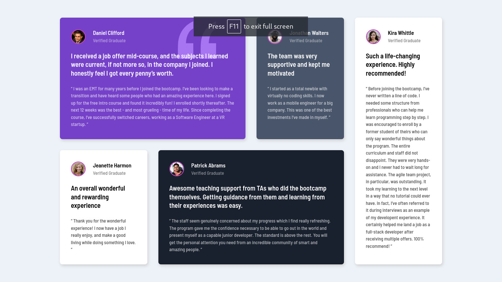

# Frontend Mentor - Testimonials grid section solution

This is a solution to the [Testimonials grid section challenge on Frontend Mentor](https://www.frontendmentor.io/challenges/testimonials-grid-section-Nnw6J7Un7). Frontend Mentor challenges help you improve your coding skills by building realistic projects. 

## Table of contents

- [Frontend Mentor - Testimonials grid section solution](#frontend-mentor---testimonials-grid-section-solution)
  - [Table of contents](#table-of-contents)
  - [Overview](#overview)
    - [Screenshot](#screenshot)
    - [Links](#links)
  - [My process](#my-process)
    - [Built with](#built-with)
  - [Author](#author)

## Overview

### Screenshot

Desktop View

Mobile View

### Links

- [Solution URL](https://github.com/reza-sjdn/testimonials-grid-section)
- [Live Demo](https://reza-sjdn.github.io/testimonials-grid-section)

## My process

### Built with

- Semantic HTML5 markup
- CSS custom properties
- Flexbox
- CSS Grid
- Mobile-first workflow

## Author

- Frontend Mentor - [@reza-sjdn](https://www.frontendmentor.io/profile/reza-sjdn)
- Twitter - [@reza_sjdn](https://www.twitter.com/reza_sjdn)
- Telegram - [@reza_sjdn80]